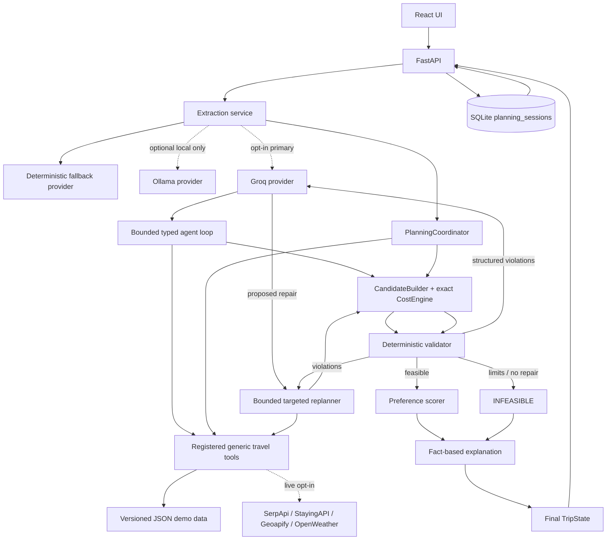

# TripMind architecture

## System view

## Authority boundary

`LLM_PROVIDER=groq` makes Groq primary for two separated responsibilities: typed natural-language extraction, then typed next-action selection from a dynamic allowlist. Each decision receives a concise structured summary of constraints, preferences, normalized candidates, advisory weather, selected IDs, current cost, validation violations, recent factual outcomes, and remaining agent/tool bounds. Groq can select only registered generic flight, hotel, route, activity, or weather operations and implemented planner actions. It cannot choose provider URLs, invoke shell/Python/SQL, browse arbitrary URLs, modify storage, change constraints, set feasibility, or calculate authoritative costs.

Every Groq extraction, action, parameter object, and corrective proposal passes a narrow Pydantic schema. The deterministic controller additionally checks requested city pairs, dates, traveler/room counts, allowed modes, current lifecycle state, and correction legality. Missing keys, timeouts, unavailable models, malformed JSON/schema, unknown actions, illegal parameters, repeated state/action pairs, and exhausted bounds are recorded before safe deterministic fallback. The optional Ollama provider remains extraction-only and localhost-only.

Deterministic Python is authoritative for `TravelRequest`/`TripState`, money, date and route consistency, candidate selection, hard-constraint validation, legal corrective actions, retry/tool-call limits, preference scoring, and final status. Soft scoring occurs only after every hard constraint passes.

## Tool modes and provenance

The default `APP_MODE=demo`, `EXTERNAL_PROVIDERS_ENABLED=false` registry is entirely local and network-independent. `APP_MODE=demo`, `LLM_PROVIDER=groq` keeps the same local tools while allowing Groq orchestration. Only the paired settings `APP_MODE=live` and `EXTERNAL_PROVIDERS_ENABLED=true` select live adapters. The mode flags must agree, preventing accidental partial activation.

Normalized options carry `source`, `is_live`, `is_estimate`, and `price_source`. Live flight and hotel quotes require authoritative INR prices. Geoapify Places supplies no admission quote, so those candidates use `price_source=unknown` and cannot enter the costed itinerary without both price and duration. Routing distance and duration are live, but route cost is a deterministic configured estimate marked `price_source=estimated`. `GET_WEATHER` stores typed results in `TripState.weather_results`; OpenWeather is advisory and never participates in hard feasibility. Out-of-window dates return a typed unavailable result and the agent may continue with other tools.

Live tool errors are structured and bounded. They do not silently select local records. If `LIVE_TOOL_FALLBACK_TO_LOCAL=true`, only provider failures may use the matching local tool; returned records remain `source=local_demo`, `is_live=false`, and record which provider failed. StayingAPI polling has an explicit maximum, all HTTP calls have timeouts, and adapter URLs are fixed application constants rather than model or user inputs.

## Planning and repair lifecycle

1. Extraction produces hard constraints, soft preferences, assumptions, and warnings.
2. In Groq mode, the coordinator creates explicit serializable `TripState`; Groq selects a legal registered action, Python executes it, and normalized results return to `TripState` before the next decision. The sequence is state-driven rather than a fixed search order.
3. `CandidateBuilder` creates an itinerary; `CostEngine` uses exact `Decimal` values.
4. The validator emits explicit checks and classified violations.
5. The replanner maps violations to legal targeted candidates. Groq may choose among them, but deterministic policy authorizes the proposal, executes it through registered tools, rebuilds state, and revalidates. Illegal or unusable proposals visibly fall back to the deterministic policy.
6. Planning stops when feasible, no legal improvement exists, a repeated state/action is detected, or configured attempt/tool limits are reached.
7. Feasible plans receive a soft-preference score. All final explanations use recorded structured facts.
8. The API persists only normal terminal states (`completed` or `infeasible`).

## Agent trace and bounds

`TripState.agent_trace` stores only structured, reviewable facts: provider, action, reason code, validated parameters, registered tool, actual travel source, status, result summary, violation, and optional before/after values. It does not store hidden reasoning, raw model conversations, provider payloads, or secrets. The synchronous frontend renders this completed trace and restored SQLite sessions render the same serialized records. `MAX_AGENT_STEPS`, `MAX_TOOL_CALLS`, and `MAX_REPLANNING_ATTEMPTS` are independent hard bounds; repeated state/action pairs, failed providers, and non-improving repairs stop safely.

## Persistence boundary

Persistence is deliberately outside `CandidateBuilder`, `ConstraintValidator`, `ReplanningEngine`, and `PreferenceScorer`. SQLAlchemy stores one `planning_sessions` row per terminal request with summary columns for history and canonical JSON for the request, final `TripState`, provider metadata, and optional natural-language response envelope. Pydantic remains the domain authority; restored JSON must validate before it is returned.

SQLite setup uses `DATABASE_URL=sqlite:///./tripmind.db`, safe `create_all`, short-lived sessions, rollback on errors, and no destructive startup reset. Exact monetary summaries are stored as decimal strings to avoid binary-float loss.

## API/UI flow

The two POST endpoints execute planning and then save. The history endpoint returns compact recent summaries, while the detail endpoint returns enough structured data to render the existing result components. The React “Recent plans” section opens natural and structured saved states without maintaining a second itinerary UI.
