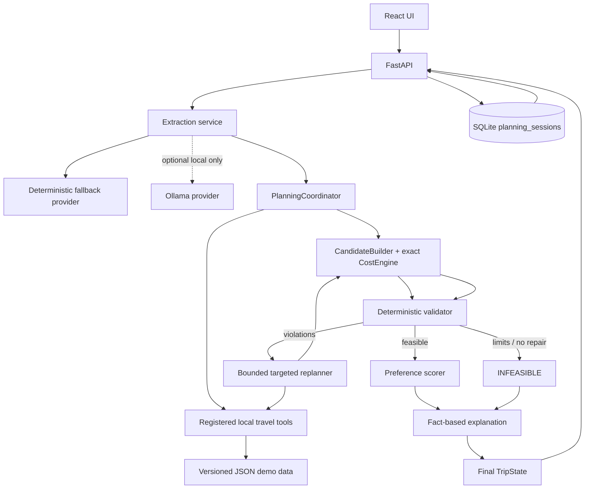

# TripMind architecture

## System view

## Authority boundary

AI-assisted components are limited to turning language into a proposed typed intent and optionally improving wording. The optional Ollama provider cannot invoke tools, modify storage, decide feasibility, or calculate authoritative costs. Its output must pass the same Pydantic validation as fallback output. Provider failure visibly falls back to the offline deterministic extractor.

Deterministic Python is authoritative for `TravelRequest`/`TripState`, money, date and route consistency, candidate selection, hard-constraint validation, legal corrective actions, retry/tool-call limits, preference scoring, and final status. Soft scoring occurs only after every hard constraint passes.

## Planning and repair lifecycle

1. Extraction produces hard constraints, soft preferences, assumptions, and warnings.
2. The coordinator creates explicit serializable `TripState` and asks registered tools for local options.
3. `CandidateBuilder` creates an itinerary; `CostEngine` uses exact `Decimal` values.
4. The validator emits explicit checks and classified violations.
5. The replanner maps violations to legal targeted actions, invokes only registered tools, rebuilds state, and revalidates.
6. Planning stops when feasible, no legal improvement exists, a repeated state/action is detected, or configured attempt/tool limits are reached.
7. Feasible plans receive a soft-preference score. All final explanations use recorded structured facts.
8. The API persists only normal terminal states (`completed` or `infeasible`).

## Persistence boundary

Persistence is deliberately outside `CandidateBuilder`, `ConstraintValidator`, `ReplanningEngine`, and `PreferenceScorer`. SQLAlchemy stores one `planning_sessions` row per terminal request with summary columns for history and canonical JSON for the request, final `TripState`, provider metadata, and optional natural-language response envelope. Pydantic remains the domain authority; restored JSON must validate before it is returned.

SQLite setup uses `DATABASE_URL=sqlite:///./tripmind.db`, safe `create_all`, short-lived sessions, rollback on errors, and no destructive startup reset. Exact monetary summaries are stored as decimal strings to avoid binary-float loss.

## API/UI flow

The two POST endpoints execute planning and then save. The history endpoint returns compact recent summaries, while the detail endpoint returns enough structured data to render the existing result components. The React “Recent plans” section opens natural and structured saved states without maintaining a second itinerary UI.
